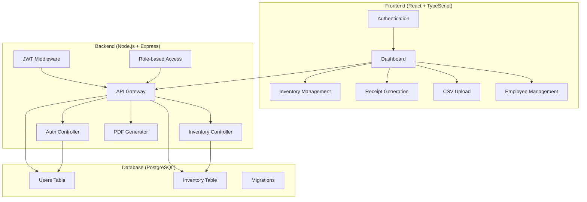

# 📦 FilFlo - Inventory Management System

<div align="center">


**A comprehensive inventory ageing dashboard and customer receipt management system**

[](https://www.typescriptlang.org/)
[](https://reactjs.org/)
[](https://nodejs.org/)
[](https://www.postgresql.org/)
[](https://expressjs.com/)
[](https://opensource.org/licenses/MIT)

[🚀 Live Demo](#-live-demo) • [📖 Documentation](#-documentation) • [🛠️ Installation](#-installation) • [🤝 Contributing](#-contributing)

</div>

---

## 🎯 Overview

**FilFlo** is a modern, full-stack inventory management system designed to help businesses track inventory ageing, monitor expiry dates, and generate customer receipts. Built with TypeScript, React, and Node.js, it provides a robust solution for inventory tracking with real-time analytics and comprehensive reporting.

### ✨ Key Highlights

- 🔐 **Role-based Authentication** - Manager and Employee roles with granular permissions
- 📊 **Real-time Dashboard** - Interactive charts and KPIs for inventory insights
- 📈 **Ageing Analytics** - Track inventory ageing and expiry risk assessment
- 📄 **PDF Receipt Generation** - Professional customer receipts with customizable templates
- 📤 **CSV Data Import** - Bulk inventory data upload and processing
- 🎨 **Modern UI/UX** - Responsive design with Tailwind CSS and Lucide icons
- 🔒 **Enterprise Security** - JWT authentication, CORS protection, and input validation
- 🧪 **Comprehensive Testing** - Unit tests with Jest for reliability

---

## 🏗️ Architecture



---

## 🚀 Features

### 🔐 Authentication & Authorization
- **Two-tier Role System**: Manager and Employee roles
- **JWT-based Authentication**: Secure token-based auth
- **Role-based Access Control**: Granular permissions for different user types
- **Password Security**: bcryptjs hashing with salt rounds

### 📊 Dashboard & Analytics
- **Real-time KPIs**: Total stock, ageing metrics, expiry alerts
- **Interactive Charts**: Ageing distribution and expiry risk visualization
- **Advanced Filtering**: Filter by part numbers, dates, batches
- **Export Capabilities**: CSV export for inventory data

### 📦 Inventory Management
- **CSV Data Import**: Bulk upload and processing of inventory data
- **Ageing Calculations**: Automatic ageing and expiry day calculations
- **Batch Tracking**: Track inventory by manufacturing batches
- **Search & Filter**: Advanced search across all inventory fields

### 📄 Receipt Generation
- **PDF Receipts**: Professional customer receipts with company branding
- **Customizable Templates**: Flexible receipt formatting
- **Tax Calculations**: Automatic tax computation
- **Receipt History**: Track all generated receipts

### 👥 Employee Management (Manager Only)
- **User Creation**: Create new employee accounts
- **Account Management**: Update and delete employee profiles
- **Role Assignment**: Assign appropriate roles to users

---

## 🛠️ Tech Stack

### Frontend
- **Framework**: React 18 with TypeScript
- **Build Tool**: Vite
- **Styling**: Tailwind CSS
- **Icons**: Lucide React
- **Charts**: Recharts
- **PDF Generation**: jsPDF
- **HTTP Client**: Axios
- **Routing**: React Router DOM

### Backend
- **Runtime**: Node.js 20+
- **Framework**: Express.js
- **Language**: TypeScript 5+
- **Database**: PostgreSQL with Sequelize ORM
- **Authentication**: JWT with bcryptjs
- **File Processing**: Multer, csv-parser
- **PDF Generation**: PDFKit
- **Testing**: Jest with ts-jest
- **Logging**: Winston
- **Security**: Helmet, CORS, express-rate-limit

### DevOps & Tools
- **Process Manager**: PM2
- **Database Migrations**: Sequelize CLI
- **Linting**: ESLint
- **Type Checking**: TypeScript Compiler
- **Version Control**: Git

---

## 📋 Prerequisites

Before you begin, ensure you have the following installed:

- **Node.js** 20.0.0 or higher
- **PostgreSQL** 12.0 or higher
- **npm** 9.0.0 or higher
- **Git** for version control

---

## 🚀 Installation

### 1. Clone the Repository

```bash
git clone https://github.com/yourusername/filflo.git
cd filflo
```

### 2. Backend Setup

```bash
cd Backend

# Install dependencies
npm install

# Copy environment variables
cp env.example .env

# Edit .env file with your configuration
# See Backend/README.md for detailed environment setup

# Create PostgreSQL database
createdb inventory_db

# Run database migrations
npm run migrate

# Build the application
npm run build
```

### 3. Frontend Setup

```bash
cd ../dashboard

# Install dependencies
npm install

# Build the application
npm run build
```

### 4. Environment Configuration

Create a `.env` file in the Backend directory:

```env
NODE_ENV=development
PORT=3001

# Database Configuration
DB_HOST=localhost
DB_PORT=5432
DB_NAME=inventory_db
DB_USER=postgres
DB_PASSWORD=your_password

# JWT Configuration
JWT_SECRET=your-super-secret-jwt-key-change-in-production
JWT_EXPIRES_IN=24h

# CORS Configuration
CORS_ORIGIN=http://localhost:5174

# File Upload Configuration
MAX_FILE_SIZE=10485760
UPLOAD_PATH=./uploads

# Logging Configuration
LOG_LEVEL=info
LOG_FILE=./logs/app.log
```

---

## 🏃‍♂️ Running the Application

### Development Mode

**Backend:**
```bash
cd Backend
npm run dev
```

**Frontend:**
```bash
cd dashboard
npm run dev
```

### Production Mode

**Backend:**
```bash
cd Backend
npm start
```

**Frontend:**
```bash
cd dashboard
npm run preview
```

### Default Login Credentials

- **Manager Account:**
  - Username: `manager`
  - Password: `manager123`
  - Role: `manager`

- **Admin Account:**
  - Username: `admin`
  - Password: `admin123`
  - Role: `admin`

---

## 📚 API Documentation

### Authentication Endpoints

#### POST `/api/login`
Login with username and password.

```json
{
  "username": "manager",
  "password": "manager123"
}
```

#### POST `/api/register`
Register a new user account.

```json
{
  "username": "newuser",
  "password": "password123",
  "email": "user@example.com",
  "role": "employee"
}
```

### Inventory Endpoints

#### POST `/api/upload-csv`
Upload CSV file with inventory data.

**Request:** Multipart form with `file` field containing CSV.

#### GET `/api/inventory`
Get inventory with filters and pagination.

**Query Parameters:**
- `jwl_part`: Filter by JWL part number
- `customer_part`: Filter by customer part number
- `mfg_start`, `mfg_end`: Manufacturing date range
- `exp_start`, `exp_end`: Expiry date range
- `search`: Search in description, batch, part numbers
- `page`: Page number (default: 1)
- `limit`: Items per page (default: 50)

#### GET `/api/dashboard-kpis`
Get dashboard KPIs and metrics.

### Receipt Endpoints

#### POST `/api/receipt`
Generate customer receipt.

```json
{
  "customer": {
    "name": "John Doe",
    "address": "123 Main St, City, State 12345",
    "email": "john@example.com",
    "phone": "555-1234"
  },
  "items": [
    {
      "jwl_part": "PART001",
      "qty": 5
    }
  ],
  "tax_rate": 10
}
```

For complete API documentation, see [Backend/README.md](Backend/README.md).

---

## 🧪 Testing

### Backend Tests

```bash
cd Backend

# Run all tests
npm test

# Run tests with coverage
npm test -- --coverage

# Run tests in watch mode
npm run test:watch
```

### Frontend Tests

```bash
cd dashboard

# Run type checking
npm run typecheck

# Run linting
npm run lint
```

---

## 🚀 Deployment

### Production Deployment

1. **Set Production Environment Variables**
2. **Use Production Database**
3. **Set Strong JWT Secret**
4. **Enable SSL/TLS**
5. **Use PM2 Process Manager**

### PM2 Configuration

```json
{
  "name": "filflo-backend",
  "script": "dist/index.js",
  "instances": "max",
  "exec_mode": "cluster",
  "env": {
    "NODE_ENV": "production"
  }
}
```

### Docker Deployment (Optional)

```dockerfile
# Backend Dockerfile
FROM node:20-alpine
WORKDIR /app
COPY package*.json ./
RUN npm ci --only=production
COPY dist ./dist
EXPOSE 3001
CMD ["npm", "start"]
```

---

## 📁 Project Structure

```
filflo/
├── Backend/                 # Node.js + Express API
│   ├── src/
│   │   ├── controllers/     # API controllers
│   │   ├── middleware/      # Authentication & validation
│   │   ├── models/          # Database models
│   │   ├── routes/          # API routes
│   │   ├── utils/           # Utility functions
│   │   └── config/          # Configuration files
│   ├── migrations/          # Database migrations
│   ├── tests/               # Unit tests
│   └── dist/                # Compiled JavaScript
├── dashboard/               # React frontend
│   ├── src/
│   │   ├── components/     # React components
│   │   ├── pages/          # Page components
│   │   ├── context/        # React context providers
│   │   ├── lib/            # API service
│   │   ├── types/          # TypeScript types
│   │   └── utils/          # Utility functions
│   └── dist/               # Built frontend
└── README.md               # This file
```

---

## 🤝 Contributing

We welcome contributions! Please follow these steps:

1. **Fork the repository**
2. **Create a feature branch**
   ```bash
   git checkout -b feature/amazing-feature
   ```
3. **Make your changes**
4. **Add tests for new functionality**
5. **Ensure all tests pass**
   ```bash
   npm test
   ```
6. **Commit your changes**
   ```bash
   git commit -m 'Add amazing feature'
   ```
7. **Push to the branch**
   ```bash
   git push origin feature/amazing-feature
   ```
8. **Open a Pull Request**

### Development Guidelines

- Follow TypeScript best practices
- Write comprehensive tests
- Use meaningful commit messages
- Follow the existing code style
- Update documentation for new features

---

## 📄 License

This project is licensed under the MIT License - see the [LICENSE](LICENSE) file for details.

---

## 🆘 Support

### Getting Help

1. **Check the Documentation**: Review this README and Backend/README.md
2. **Search Issues**: Look through existing GitHub issues
3. **Create an Issue**: Provide detailed information about your problem

### Issue Template

When creating an issue, please include:

- **Description**: Clear description of the problem
- **Steps to Reproduce**: Detailed steps to reproduce the issue
- **Expected Behavior**: What you expected to happen
- **Actual Behavior**: What actually happened
- **Environment**: OS, Node.js version, browser version
- **Screenshots**: If applicable

---

## 🎯 Roadmap

### Upcoming Features

- [ ] **Mobile App**: React Native mobile application
- [ ] **Advanced Analytics**: Machine learning for inventory predictions
- [ ] **Multi-tenant Support**: Support for multiple organizations
- [ ] **API Rate Limiting**: Enhanced API protection
- [ ] **Real-time Notifications**: WebSocket-based notifications
- [ ] **Barcode Scanning**: Inventory tracking with barcodes
- [ ] **Advanced Reporting**: Custom report generation
- [ ] **Integration APIs**: Third-party system integrations

### Version History

- **v1.0.0** - Initial release with core inventory management features
- **v1.1.0** - Enhanced dashboard with advanced filtering
- **v1.2.0** - PDF receipt generation improvements
- **v2.0.0** - Role-based access control and employee management

---

## 🙏 Acknowledgments

- **React Team** for the amazing frontend framework
- **Express.js Team** for the robust backend framework
- **PostgreSQL Team** for the reliable database
- **TypeScript Team** for the type safety
- **Tailwind CSS** for the utility-first CSS framework
- **All Contributors** who have helped improve this project

---

<div align="center">

**Made with ❤️ by the FilFlo Team**

[⭐ Star this repo](https://github.com/yourusername/filflo) • [🐛 Report Bug](https://github.com/yourusername/filflo/issues) • [💡 Request Feature](https://github.com/yourusername/filflo/issues)

</div>
